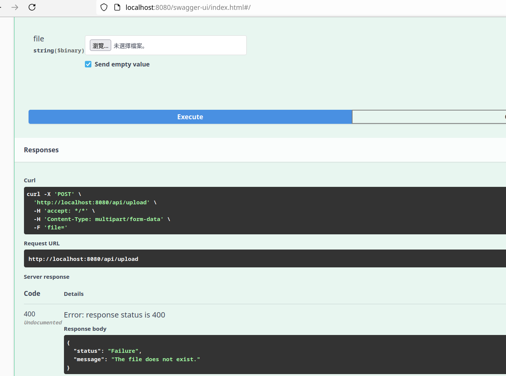
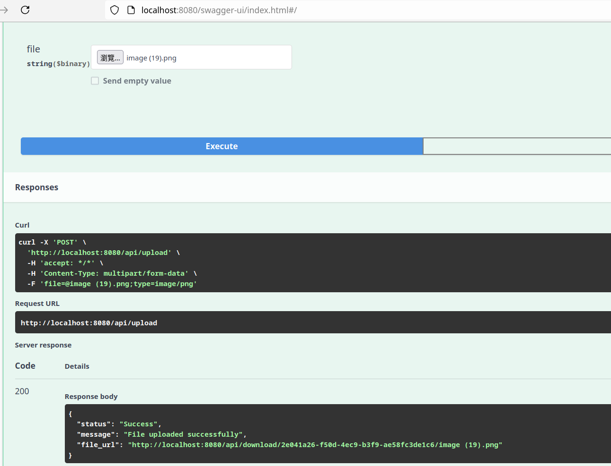
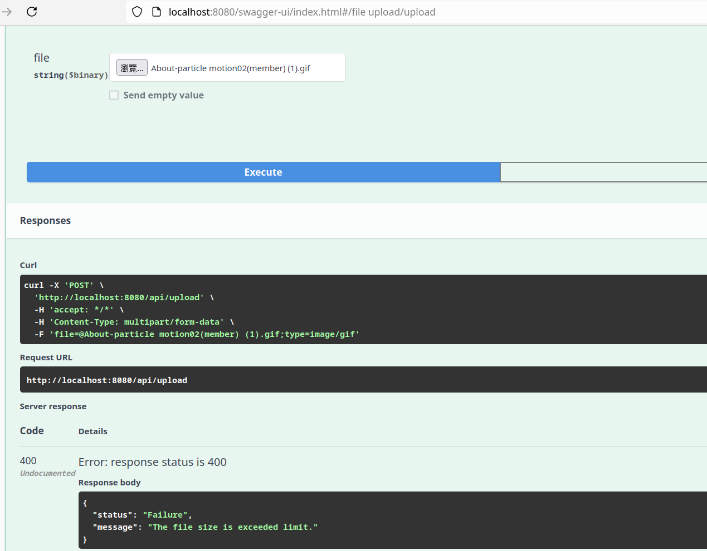

# File Upload Service Documentation

### Environments
- **Java**: 17
- **Spring Boot**: 3.3.5
- **Linux**: Kubuntu 24.04

### Swagger UI
Access the Swagger UI to test the API documentation:
[Swagger UI](http://localhost:8080/swagger-ui/index.html#/)

### Supported File Types
The service allows uploads of the following file types:
- PDF
- Images
- CSV

### File Limit
**10 MB**

### Demo

#### Upload Empty File
This demonstrates the behavior when an empty file is uploaded.

#### Upload Image File
This shows a successful image file upload.

#### Download File
This illustrates downloading a file after upload.

#### Exceed Limit
This demonstrates the behavior when a big file is uploaded.

